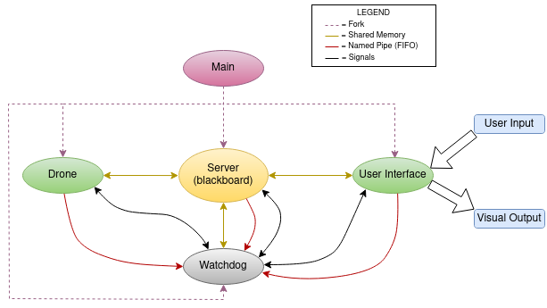

Advanced_Robot_Programming-Assignment_1
================================

Introduction
----------------------
The following repository contains the solution to the first assignment for the Advanced Robot Programming course, found in the Robotics Masters Programme at the University of Genoa, Italy. As part of this assignment,
students were required to program a drone simulator in which a drone, represented by a blue '+', was to be depicted in a window and was capable of being actuated around this space via user inputs.
The following work has been performed by Mark Henry Dsouza.

Table of Contents
----------------------
1. [Architecture](https://github.com/Markie3110/Advanced_Robot_Programming-Assignment_1#architecture)
2. [Overview](https://github.com/Markie3110/Advanced_Robot_Programming-Assignment_1#overview)
3. [Installation](https://github.com/Markie3110/Advanced_Robot_Programming-Assignment_1#installation)
4. [How to Run](https://github.com/Markie3110/Advanced_Robot_Programming-Assignment_1#how-to-run)
5. [Operational instructions](https://github.com/Markie3110/Advanced_Robot_Programming-Assignment_1#operational-instructions)
6. [Known Errors](https://github.com/Markie3110/Advanced_Robot_Programming-Assignment_1#known-errors)
7. [Authors Notes](https://github.com/Markie3110/Advanced_Robot_Programming-Assignment_1#authors-notes)


Architecture
----------------------
Shown here is the software architecture of the system depicting the parent/child relationships as well as interprocess communications used.<br>


Overview
----------------------
As depicted in the architecture, the system consists of 5 core processes, namely: main, server, user interface, drone and watchdog, that all work concurrently to run the simulator. Besides the core programs, we also have two header files: parameters and log that are used by the core files during runtime. A detailed description of each is given below.

### Main ###
Main is the parent process of the entire system and is solely responsible for executing each and every individual process required by the simulator. It does this by repeatedly forking itself using the `fork()` function, and then executing each process within the newly created child with `execvp()`. Once all the necessary processes have been created, main waits until all the created children have ended their execution, following which it itself is terminated.

### Server ###
The server is the first of the core processes to be run by the parent. Its role is to create and allocate shared memory spaces that will subsequently be used by the different processes to transfer data, along with any necessary semaphores needed for the same. Given below are the different variables transfered using the shared memory objects, along with their respective producers and consumers:
| Variable | Producer Process | Consumer Processes |
| --- | --- | --- |
| Watchdog PID | watchdog | server, UI, drone |
| Window Size | UI | drone |
| Drone Position | drone | UI |
| --- | --- | --- |
<br>Once the shared memory objects have been created, the server runs in a loop with a time interval until it receives a terminate signal (`SIGTERM`) either from the watchdog, or due to a user input.

### User interface ###
The user interface is the frontend process for the entire system. It is the location where all the inputs from the user are gathered, as well as where all the visual outputs to the user are depicted. The process first creates a graphical user interface with the help of the `ncurses` library, consisting of two windows: one drone window, to depict the virtual environement the drone moves in, and an inspector window, that displays the drone's position numerically. Subsequently, the process enters a loop where in each iteration, it looks to see if the user has given any key inputs using the `wgetch()` function, following which it passes on the acquired keyvalue to the shared memory. Given that there may be times the user does not provide any input, to ensure that the `wgetch()` function does not block each iteration of the loop indefinetely waiting for it, we also use the `wtimeout()` function, which specifies a maximum time interval `wgetch()` should wait for, at the end of which the execution is continued. Besides passing keyvalues, the UI also reads the latest drone position from the shared memory and depicts it as such. 

### Drone ###


### Watchdog ###

## Supplementary Files ##

### Parameters ###

### Log ###


Installation
----------------------
The core content of the project can be found in the folder "Assignment_1". To download the repository's contents to your local system you can do one of the following:

1. Using git from your local system<br>
To download the repo using git simply go to your terminal and go to the root directory of your system. Type the following command to clone the repository:
```bash
$ git clone "https://github.com/Markie3110/Advanced_Robot_Programming-Assignment_1"
```

2. Download the .zip from Github<br>
In a browser go to the repository on Github and download the .zip file availabe in the code dropdown box found at the top right. Unzip the file to access the contents.<br><br>
NOTE: Due to the use of named FIFOs with paths, it is important that the Assignment_1 folder is stored in the root directory of your system. There should be no intermediary folders between the root and Assignment_1
folder or else the system will not run.


How to Run
----------------------
To both build the executables and run the system, navigate to the src folder within a terminal and type in the following command:
```bash
make
```
The simulator should compile and then execute.

Operational instructions
----------------------
To operate the drone use the following keys:
```
'q' 'w' 'e'
'a' 's' 'd'
'z' 'x' 'c'
```
The keys represent the following movements for the drone
* `q`: TOP-LEFT
* `w`: TOP
* `e`: TOP-RIGHT
* `a`: LEFT
* `s`: STOP
* `d`: RIGHT
* `z`: BOTTOM-LEFT
* `x`: BOTTOM
* `c`: BOTTOM-RIGHT
<br><br>In addition, `k` and `l` can be used to reset the drone to its starting point and shut down the entire system respectively.

Known Errors
----------------------

Authors Notes
----------------------
